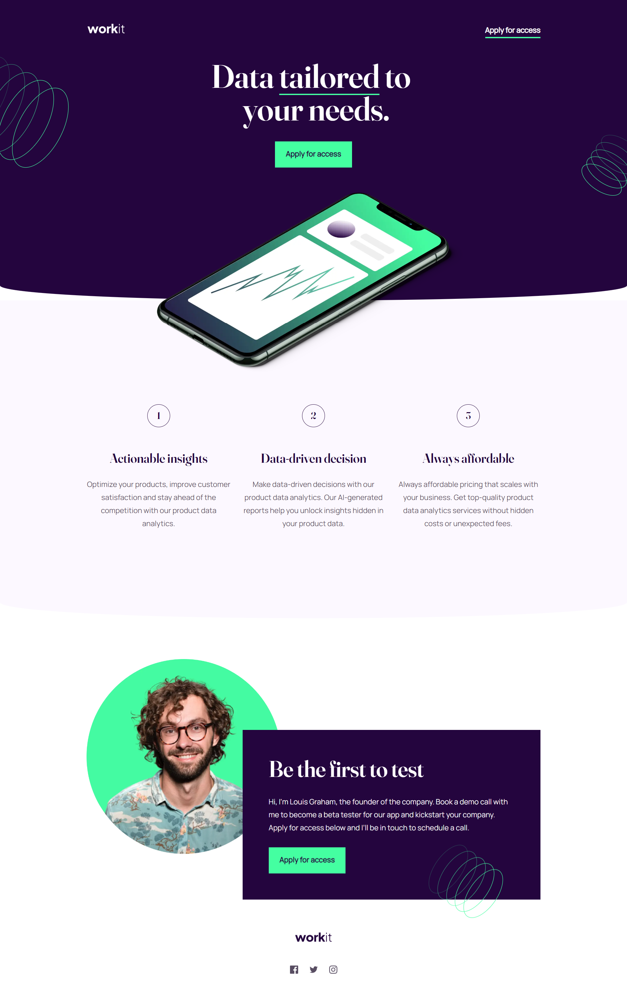

# Frontend Mentor - Workit landing page solution

This is a solution to the [Workit landing page challenge on Frontend Mentor](https://www.frontendmentor.io/challenges/workit-landing-page-2fYnyle5lu). Frontend Mentor challenges help you improve your coding skills by building realistic projects. 

## Table of contents

- [Overview](#overview)
  - [The challenge](#the-challenge)
  - [Screenshot](#screenshot)
  - [Links](#links)
- [My process](#my-process)
  - [Built with](#built-with)
  - [Useful resources](#useful-resources)
- [Author](#author)

## Overview

### The challenge

Users should be able to:

- View the optimal layout for the interface depending on their device's screen size
- See hover and focus states for all interactive elements on the page

### Screenshot

### Links

- [Solution URL](https://github.com/diogohenriquesc/fm-workit)
- [Live Site URL](https://diogohenriquesc.github.io/fm-workit/)

## My process

### Built with

- Semantic HTML5 markup
- CSS custom properties
- Flexbox
- Mobile-first workflow
- [Sass](https://sass-lang.com/) - Css preprocessor

### Useful resources

- [Border radius generator](https://9elements.github.io/fancy-border-radius/full-control.html) - This helped me to build the curved section, may not be best way but it helped!

## Author

- Github - [Diogo](https://www.github.com/diogohenriquesc)
- Frontend Mentor - [@diogohenriquesc](https://www.frontendmentor.io/profile/diogohenriquesc)